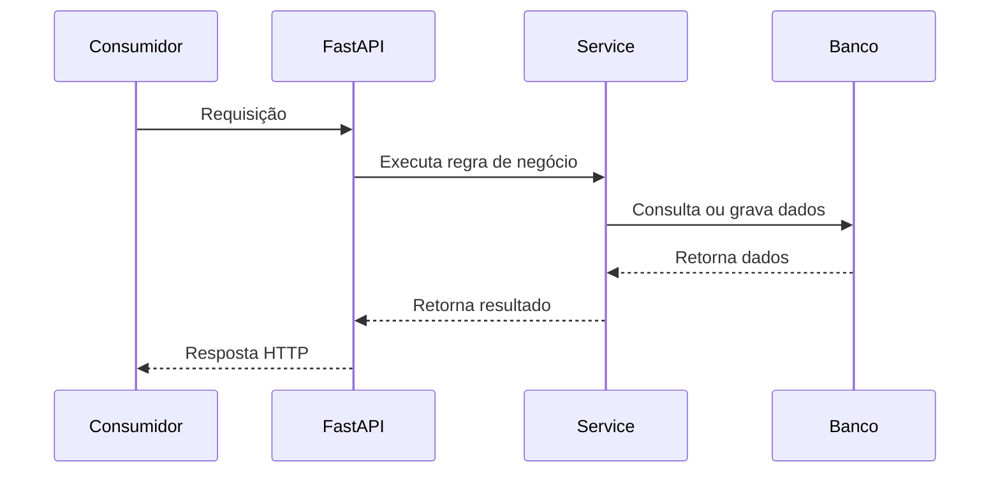
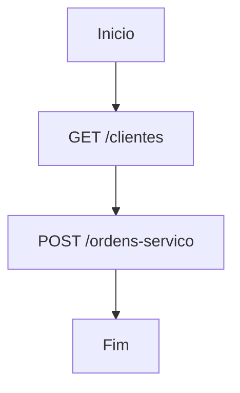

# Templates de documentação

## 1) Catálogo de endpoints
Arquivo: `docs/api-process-map/endpoint-catalog.yml`

```yaml
project:
  name: pendente
  framework: FastAPI
  documentation_version: 1
  last_mapping_date: pendente
  mapped_by: Cursor Skill - FastAPI Process Mapper
endpoints:
  - id: GET_CLIENTES_LISTAR
    method: GET
    path: /clientes
    full_path: /api/v1/clientes
    router_prefix: /api/v1
    router_file: app/api/v1/clientes_router.py
    function_name: listar_clientes
    swagger:
      has_summary: true
      has_description: false
      has_tags: true
      has_responses: false
      has_examples: false
      operation_id: clientes_listar
    technical:
      request_schema: null
      response_schema: ClienteResponse
      query_params: []
      path_params: []
      body_params: []
      dependencies: []
      services: []
      repositories: []
      models: []
      database:
        engine: pendente_validacao_usuario
        tables: []
      external_apis: []
      queues: []
      cache: []
      logs: []
      errors: []
    business:
      functional_name: pendente_validacao_usuario
      description: pendente_validacao_usuario
      business_processes: [pendente_validacao_usuario]
      consumers: [pendente_validacao_usuario]
      used_by_projects: [pendente_validacao_usuario]
      criticality: pendente_validacao_usuario
      impact: pendente_validacao_usuario
      business_rules: [pendente_validacao_usuario]
    dependencies:
      before_routes: []
      after_routes: []
      related_fastapi_projects: []
      related_legacy_systems: []
      related_frontends: []
    documentation:
      endpoint_doc: docs/api-process-map/endpoints/GET-clientes-listar.md
      process_docs: []
      diagrams: []
    status: pendente_validacao_usuario
    source_control:
      technical_info_source: detectado_no_codigo
      business_info_source: pendente_validacao_usuario
```

## 2) Documento por endpoint
Arquivo: `docs/api-process-map/endpoints/METODO-rota-normalizada.md`

```markdown
# [MÉTODO] [PATH] — [Nome funcional]
## Resumo
Descrição clara da finalidade da rota.
## Status da documentação
| Item | Status |
|---|---|
| Mapeamento técnico | Detectado |
| Processo funcional | Confirmado/Pendente |
| Consumidor | Confirmado/Pendente |
| Swagger atualizado | Sim/Não |
| Diagrama criado | Sim/Não |
## Informações técnicas
| Campo | Valor |
|---|---|
| Método | |
| Path | |
| Path completo | |
| Router | |
| Função | |
| Tags | |
| Request schema | |
| Response schema | |
| Autenticação | |
| Banco | |
| Tabelas | |
## Contrato da rota
### Request
Descrever parâmetros, body e headers.
### Response
Descrever retorno esperado.
### Códigos de resposta
| Código | Descrição |
|---|---|
| 200 | Sucesso |
| 400 | Requisição inválida |
| 401 | Não autenticado |
| 403 | Sem permissão |
| 404 | Não encontrado |
| 500 | Erro interno |
## Processos da empresa relacionados
- pendente_validacao_usuario
## Consumidores conhecidos
- pendente_validacao_usuario
## Dependências
### Antes da chamada
- pendente_validacao_usuario
### Depois da chamada
- pendente_validacao_usuario
### Outros projetos FastAPI relacionados
- pendente_validacao_usuario
### Sistemas legados relacionados
- pendente_validacao_usuario
## Regras de negócio
- pendente_validacao_usuario
## Riscos de alteração
- pendente_validacao_usuario
## Criticidade
pendente_validacao_usuario
## Exemplo de uso
```http
GET /clientes HTTP/1.1
Authorization: Bearer <token>
```
## Diagrama técnico

## Pendências
- pendente_validacao_usuario
```

## 3) Documento por processo
Arquivo: `docs/api-process-map/processos/nome-do-processo.md`

```markdown
# Processo: [Nome do processo]
## Objetivo
Explicar o objetivo funcional do processo.
## Sistemas envolvidos
- FastAPI atual
- Frontend
- Outros projetos FastAPI
- Sistemas legados
- Banco de dados
- Integrações externas
## Endpoints envolvidos
| Ordem | Método | Rota | Finalidade | Criticidade |
|---|---|---|---|---|
| 1 | GET | /clientes | Listar clientes | Alta |
## Fluxo funcional
1. Descrever primeiro passo.
2. Descrever segundo passo.
3. Descrever terceiro passo.
## Fluxo técnico
1. Consumidor chama endpoint.
2. API valida autenticação.
3. API executa service.
4. Service acessa banco ou integração.
5. API retorna resposta.
## Dependências
### Dependências internas
- Endpoint A depende do endpoint B.
### Dependências externas
- Outra API FastAPI.
- ERP.
- SGA.
- Serviço externo.
## Pontos críticos
- Alterações de contrato podem impactar tela X.
## Impacto de alteração
Explicar impacto.
## Diagrama do processo

## Pendências
- pendente_validacao_usuario
```

## 4) Matriz de impacto
Arquivo: `docs/api-process-map/matriz-impacto.md`

```markdown
# Matriz de impacto dos endpoints
| Endpoint | Processos impactados | Consumidores | Criticidade | Risco | Status |
|---|---|---|---|---|---|
| GET /clientes | Abertura de OS | Frontend, API Transportes | Alta | Pode quebrar seleção de cliente | Confirmado |

# Matriz de processos por endpoint
| Processo | Endpoints usados | Sistemas envolvidos | Risco geral |
|---|---|---|---|
| Abertura de OS | GET /clientes, POST /ordens-servico | FastAPI, Frontend, SGA | Alto |
```

## 5) Pendências e relatório
Arquivos:
- `docs/api-process-map/pendencias.md`
- `docs/api-process-map/reports/status-documentacao.md`

Registrar sempre:
- endpoints sem processo/consumidor/criticidade;
- gaps de Swagger (`description`, `responses`, exemplos);
- perguntas objetivas para validação do usuário;
- métricas de cobertura da documentação.

## 6) Mapeamento local -> Mural hierárquico
- Endpoint local permanece em `docs/api-process-map/endpoints/*.md`.
- Publicação no Mural deve virar subitem do raiz do projeto, não item solto.
- Usar `doc_kind` por tipo de artefato (`overview`, `endpoint`, `process`, `report`).
- Para vínculo estável entre ambientes, preferir `parent_external_id` no envio de subitens.

## Convenções obrigatórias

### Diagramas Mermaid no HTML (Mural)
- Preferir Mermaid para diagramas técnicos e funcionais.
- Em bloco HTML, usar:
  - `<pre><code class="language-mermaid">...diagrama...</code></pre>`
- O conteúdo do diagrama deve ter quebra de linha real no texto armazenado.
- Não serializar o diagrama com `\n` literal; isso quebra leitura humana e pode impedir renderização.

### Links externos
- Em conteúdo HTML publicado, todo link externo deve incluir:
  - `target="_blank"`
  - `rel="noopener noreferrer"`

### `operation_id`
- Padrão: `modulo_acao`.
- Exemplos: `clientes_listar`, `ordens_servico_criar`.
- Não alterar `operation_id` sem validação quando houver consumo externo.

### Criticidade permitida
- `Baixa`, `Média`, `Alta`, `Crítica`, `pendente_validacao_usuario`.
- Nunca marcar `Crítica` sem confirmação do usuário.

### Fontes de informação
- `detectado_no_codigo`
- `inferido_pelo_agente`
- `confirmado_pelo_usuario`
- `pendente_validacao_usuario`
